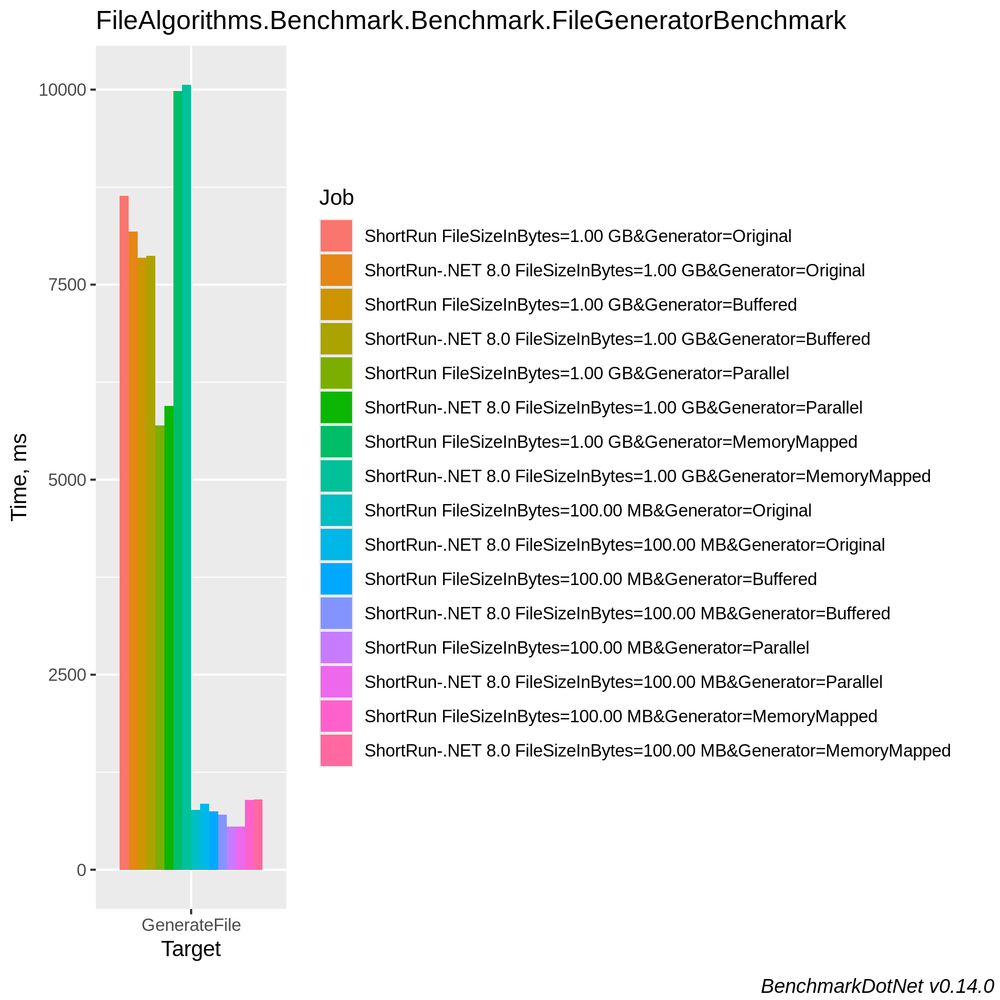
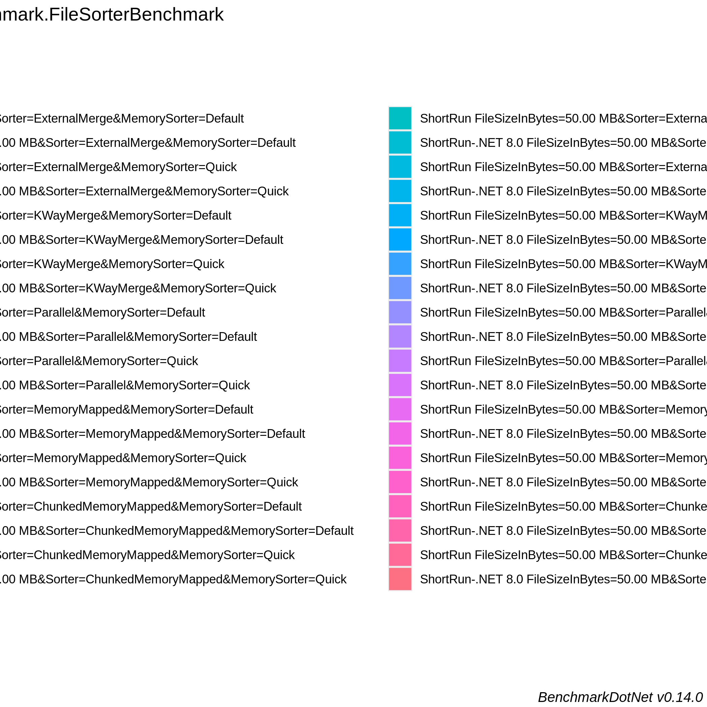
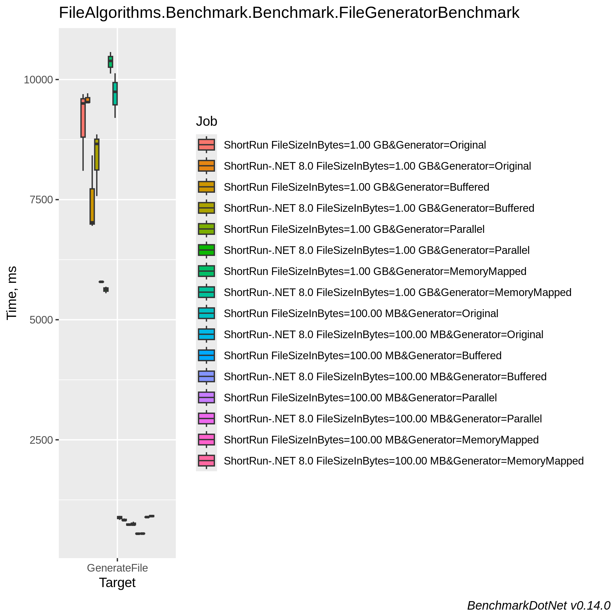
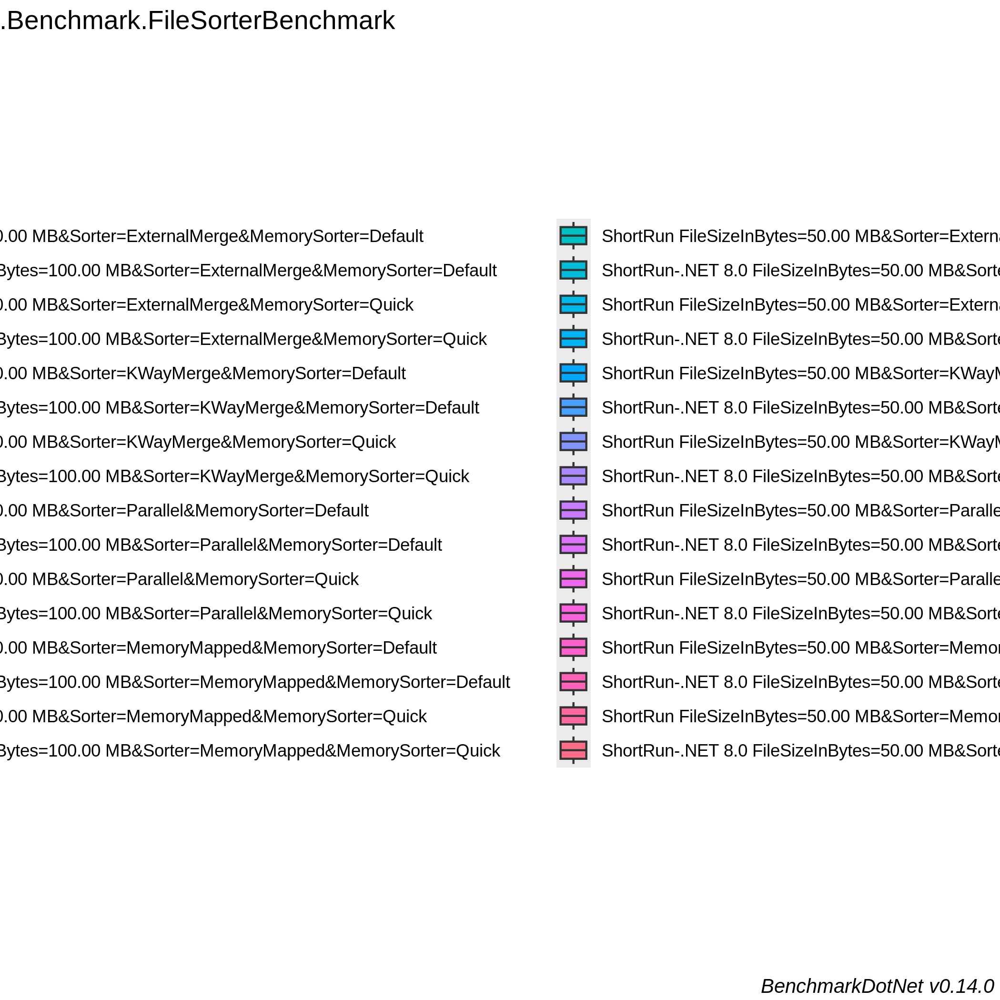

<!-- BENCHMARK RESULTS START -->

## Benchmark Results

*Last updated on Wed Oct  2 11:13:08 UTC 2024 UTC*

```

BenchmarkDotNet v0.14.0, Ubuntu 22.04.5 LTS (Jammy Jellyfish)
AMD EPYC 7763, 1 CPU, 2 logical cores and 1 physical core
.NET SDK 8.0.402
  [Host]            : .NET 8.0.8 (8.0.824.36612), X64 RyuJIT AVX2
  ShortRun          : .NET 8.0.8 (8.0.824.36612), X64 RyuJIT AVX2
  ShortRun-.NET 8.0 : .NET 8.0.8 (8.0.824.36612), X64 RyuJIT AVX2

Runtime=.NET 8.0  IterationCount=3  LaunchCount=1  
WarmupCount=3  

```
| Method       | Job               | FileSizeInBytes | Generator    | Mean      | Error     | StdDev   | StdErr   | Min       | Q1        | Median    | Q3        | Max       | Op/s   | Rank | Gen0        | Gen1        | Gen2        | Allocated  |
|------------- |------------------ |---------------- |------------- |----------:|----------:|---------:|---------:|----------:|----------:|----------:|----------:|----------:|-------:|-----:|------------:|------------:|------------:|-----------:|
| **GenerateFile** | **ShortRun**          | **1.00 GB**         | **Original**     |  **8.4315 s** | **17.0948 s** | **0.9370 s** | **0.5410 s** |  **7.4036 s** |  **8.0282 s** |  **8.6528 s** |  **8.9454 s** |  **9.2380 s** | **0.1186** |    **3** |  **75000.0000** |           **-** |           **-** | **5992.15 MB** |
| GenerateFile | ShortRun-.NET 8.0 | 1.00 GB         | Original     |  8.8990 s | 13.7195 s | 0.7520 s | 0.4342 s |  8.0484 s |  8.6107 s |  9.1729 s |  9.3243 s |  9.4757 s | 0.1124 |    3 |  75000.0000 |           - |           - | 5992.33 MB |
| **GenerateFile** | **ShortRun**          | **1.00 GB**         | **Buffered**     |  **7.4304 s** | **15.3526 s** | **0.8415 s** | **0.4859 s** |  **6.9117 s** |  **6.9449 s** |  **6.9781 s** |  **7.6897 s** |  **8.4013 s** | **0.1346** |    **3** | **667000.0000** | **629000.0000** | **629000.0000** | **5125.73 MB** |
| GenerateFile | ShortRun-.NET 8.0 | 1.00 GB         | Buffered     |  8.1789 s | 23.6069 s | 1.2940 s | 0.7471 s |  6.6973 s |  7.7249 s |  8.7526 s |  8.9197 s |  9.0868 s | 0.1223 |    3 | 668000.0000 | 630000.0000 | 630000.0000 | 5125.42 MB |
| **GenerateFile** | **ShortRun**          | **1.00 GB**         | **Parallel**     |  **5.7925 s** |  **0.0830 s** | **0.0046 s** | **0.0026 s** |  **5.7872 s** |  **5.7911 s** |  **5.7949 s** |  **5.7951 s** |  **5.7953 s** | **0.1726** |    **3** |   **5000.0000** |   **5000.0000** |   **5000.0000** | **4099.99 MB** |
| GenerateFile | ShortRun-.NET 8.0 | 1.00 GB         | Parallel     |  5.6746 s |  1.3926 s | 0.0763 s | 0.0441 s |  5.5927 s |  5.6400 s |  5.6872 s |  5.7155 s |  5.7438 s | 0.1762 |    3 |   5000.0000 |   5000.0000 |   5000.0000 | 4100.05 MB |
| **GenerateFile** | **ShortRun**          | **1.00 GB**         | **MemoryMapped** |  **9.9895 s** |  **0.6748 s** | **0.0370 s** | **0.0214 s** |  **9.9567 s** |  **9.9694 s** |  **9.9822 s** | **10.0059 s** | **10.0296 s** | **0.1001** |    **3** | **101000.0000** |           **-** |           **-** | **8115.43 MB** |
| GenerateFile | ShortRun-.NET 8.0 | 1.00 GB         | MemoryMapped | 10.2270 s |  2.1033 s | 0.1153 s | 0.0666 s | 10.0949 s | 10.1866 s | 10.2783 s | 10.2930 s | 10.3077 s | 0.0978 |    3 | 101000.0000 |           - |           - | 8115.31 MB |
| **GenerateFile** | **ShortRun**          | **100.00 MB**       | **Original**     |  **0.8404 s** |  **0.6152 s** | **0.0337 s** | **0.0195 s** |  **0.8031 s** |  **0.8262 s** |  **0.8493 s** |  **0.8590 s** |  **0.8688 s** | **1.1899** |    **2** |   **7000.0000** |           **-** |           **-** |   **585.5 MB** |
| GenerateFile | ShortRun-.NET 8.0 | 100.00 MB       | Original     |  0.8247 s |  0.3404 s | 0.0187 s | 0.0108 s |  0.8118 s |  0.8140 s |  0.8163 s |  0.8312 s |  0.8461 s | 1.2125 |    2 |   7000.0000 |           - |           - |  585.49 MB |
| **GenerateFile** | **ShortRun**          | **100.00 MB**       | **Buffered**     |  **0.7639 s** |  **0.7248 s** | **0.0397 s** | **0.0229 s** |  **0.7201 s** |  **0.7470 s** |  **0.7739 s** |  **0.7858 s** |  **0.7976 s** | **1.3091** |    **2** |  **63000.0000** |  **60000.0000** |  **60000.0000** |  **502.72 MB** |
| GenerateFile | ShortRun-.NET 8.0 | 100.00 MB       | Buffered     |  0.7444 s |  0.9688 s | 0.0531 s | 0.0307 s |  0.6888 s |  0.7193 s |  0.7499 s |  0.7722 s |  0.7945 s | 1.3434 |    2 |  64000.0000 |  61000.0000 |  61000.0000 |  502.77 MB |
| **GenerateFile** | **ShortRun**          | **100.00 MB**       | **Parallel**     |  **0.5480 s** |  **0.1070 s** | **0.0059 s** | **0.0034 s** |  **0.5414 s** |  **0.5458 s** |  **0.5502 s** |  **0.5514 s** |  **0.5525 s** | **1.8247** |    **1** |   **1000.0000** |   **1000.0000** |   **1000.0000** |  **440.75 MB** |
| GenerateFile | ShortRun-.NET 8.0 | 100.00 MB       | Parallel     |  0.5447 s |  0.0614 s | 0.0034 s | 0.0019 s |  0.5424 s |  0.5427 s |  0.5430 s |  0.5458 s |  0.5485 s | 1.8360 |    1 |   2000.0000 |   2000.0000 |   2000.0000 |  440.76 MB |
| **GenerateFile** | **ShortRun**          | **100.00 MB**       | **MemoryMapped** |  **0.8951 s** |  **0.0402 s** | **0.0022 s** | **0.0013 s** |  **0.8933 s** |  **0.8939 s** |  **0.8944 s** |  **0.8960 s** |  **0.8976 s** | **1.1172** |    **2** |   **9000.0000** |           **-** |           **-** |  **792.44 MB** |
| GenerateFile | ShortRun-.NET 8.0 | 100.00 MB       | MemoryMapped |  0.9003 s |  0.2312 s | 0.0127 s | 0.0073 s |  0.8888 s |  0.8935 s |  0.8983 s |  0.9061 s |  0.9139 s | 1.1107 |    2 |   9000.0000 |           - |           - |   792.5 MB |
```

BenchmarkDotNet v0.14.0, Ubuntu 22.04.5 LTS (Jammy Jellyfish)
AMD EPYC 7763, 1 CPU, 2 logical cores and 1 physical core
.NET SDK 8.0.402
  [Host]            : .NET 8.0.8 (8.0.824.36612), X64 RyuJIT AVX2
  ShortRun          : .NET 8.0.8 (8.0.824.36612), X64 RyuJIT AVX2
  ShortRun-.NET 8.0 : .NET 8.0.8 (8.0.824.36612), X64 RyuJIT AVX2

Runtime=.NET 8.0  IterationCount=3  LaunchCount=1  
WarmupCount=3  

```
| Method   | Job               | FileSizeInBytes | Sorter              | MemorySorter | Mean     | Error   | StdDev   | StdErr   | Min      | Q1       | Median   | Q3       | Max      | Op/s   | Rank | Gen0        | Gen1       | Gen2      | Allocated   |
|--------- |------------------ |---------------- |-------------------- |------------- |---------:|--------:|---------:|---------:|---------:|---------:|---------:|---------:|---------:|-------:|-----:|------------:|-----------:|----------:|------------:|
| **SortFile** | **ShortRun**          | **100.00 MB**       | **ExternalMerge**       | **Default**      | **18.522 s** | **4.414 s** | **0.2419 s** | **0.1397 s** | **18.376 s** | **18.383 s** | **18.389 s** | **18.595 s** | **18.801 s** | **0.0540** |    **2** | **255000.0000** | **12000.0000** | **3000.0000** | **20200.57 MB** |
| SortFile | ShortRun-.NET 8.0 | 100.00 MB       | ExternalMerge       | Default      | 18.352 s | 2.926 s | 0.1604 s | 0.0926 s | 18.180 s | 18.280 s | 18.380 s | 18.439 s | 18.497 s | 0.0545 |    2 | 252000.0000 | 12000.0000 | 3000.0000 | 19962.78 MB |
| **SortFile** | **ShortRun**          | **100.00 MB**       | **ExternalMerge**       | **Quick**        | **20.588 s** | **5.089 s** | **0.2790 s** | **0.1611 s** | **20.267 s** | **20.498 s** | **20.730 s** | **20.749 s** | **20.768 s** | **0.0486** |    **2** | **273000.0000** | **12000.0000** | **3000.0000** |  **21685.4 MB** |
| SortFile | ShortRun-.NET 8.0 | 100.00 MB       | ExternalMerge       | Quick        | 20.522 s | 2.909 s | 0.1594 s | 0.0920 s | 20.357 s | 20.445 s | 20.532 s | 20.604 s | 20.676 s | 0.0487 |    2 | 275000.0000 | 12000.0000 | 3000.0000 | 21836.26 MB |
| **SortFile** | **ShortRun**          | **100.00 MB**       | **KWayMerge**           | **Default**      | **19.206 s** | **3.793 s** | **0.2079 s** | **0.1200 s** | **18.972 s** | **19.125 s** | **19.278 s** | **19.324 s** | **19.369 s** | **0.0521** |    **2** | **255000.0000** | **12000.0000** | **3000.0000** | **20221.99 MB** |
| SortFile | ShortRun-.NET 8.0 | 100.00 MB       | KWayMerge           | Default      | 18.901 s | 5.860 s | 0.3212 s | 0.1854 s | 18.530 s | 18.798 s | 19.065 s | 19.086 s | 19.106 s | 0.0529 |    2 | 252000.0000 | 12000.0000 | 3000.0000 | 20016.33 MB |
| **SortFile** | **ShortRun**          | **100.00 MB**       | **KWayMerge**           | **Quick**        | **20.453 s** | **5.987 s** | **0.3282 s** | **0.1895 s** | **20.236 s** | **20.264 s** | **20.291 s** | **20.561 s** | **20.830 s** | **0.0489** |    **2** | **280000.0000** | **12000.0000** | **3000.0000** | **22228.91 MB** |
| SortFile | ShortRun-.NET 8.0 | 100.00 MB       | KWayMerge           | Quick        | 21.513 s | 3.558 s | 0.1950 s | 0.1126 s | 21.312 s | 21.418 s | 21.524 s | 21.613 s | 21.702 s | 0.0465 |    2 | 285000.0000 | 12000.0000 | 3000.0000 | 22636.41 MB |
| **SortFile** | **ShortRun**          | **100.00 MB**       | **Parallel**            | **Default**      | **19.166 s** | **4.313 s** | **0.2364 s** | **0.1365 s** | **18.938 s** | **19.044 s** | **19.150 s** | **19.280 s** | **19.410 s** | **0.0522** |    **2** | **256000.0000** | **12000.0000** | **3000.0000** | **20368.78 MB** |
| SortFile | ShortRun-.NET 8.0 | 100.00 MB       | Parallel            | Default      | 18.588 s | 2.506 s | 0.1373 s | 0.0793 s | 18.496 s | 18.509 s | 18.523 s | 18.634 s | 18.746 s | 0.0538 |    2 | 253000.0000 | 12000.0000 | 3000.0000 | 20123.62 MB |
| **SortFile** | **ShortRun**          | **100.00 MB**       | **Parallel**            | **Quick**        | **20.367 s** | **7.131 s** | **0.3909 s** | **0.2257 s** | **20.088 s** | **20.144 s** | **20.200 s** | **20.507 s** | **20.814 s** | **0.0491** |    **2** | **273000.0000** | **12000.0000** | **3000.0000** | **21734.95 MB** |
| SortFile | ShortRun-.NET 8.0 | 100.00 MB       | Parallel            | Quick        | 20.117 s | 6.726 s | 0.3687 s | 0.2129 s | 19.736 s | 19.939 s | 20.142 s | 20.307 s | 20.473 s | 0.0497 |    2 | 287000.0000 | 12000.0000 | 3000.0000 | 22813.88 MB |
| **SortFile** | **ShortRun**          | **100.00 MB**       | **MemoryMapped**        | **Default**      | **17.576 s** | **4.121 s** | **0.2259 s** | **0.1304 s** | **17.406 s** | **17.448 s** | **17.489 s** | **17.661 s** | **17.832 s** | **0.0569** |    **2** | **240000.0000** | **21000.0000** | **5000.0000** | **18954.73 MB** |
| SortFile | ShortRun-.NET 8.0 | 100.00 MB       | MemoryMapped        | Default      | 17.448 s | 5.315 s | 0.2913 s | 0.1682 s | 17.268 s | 17.280 s | 17.292 s | 17.538 s | 17.784 s | 0.0573 |    2 | 244000.0000 | 21000.0000 | 5000.0000 | 19211.54 MB |
| **SortFile** | **ShortRun**          | **100.00 MB**       | **MemoryMapped**        | **Quick**        | **18.632 s** | **4.468 s** | **0.2449 s** | **0.1414 s** | **18.436 s** | **18.495 s** | **18.554 s** | **18.731 s** | **18.907 s** | **0.0537** |    **2** | **258000.0000** | **19000.0000** | **3000.0000** | **20490.44 MB** |
| SortFile | ShortRun-.NET 8.0 | 100.00 MB       | MemoryMapped        | Quick        | 19.171 s | 3.488 s | 0.1912 s | 0.1104 s | 19.029 s | 19.062 s | 19.096 s | 19.242 s | 19.388 s | 0.0522 |    2 | 271000.0000 | 21000.0000 | 5000.0000 | 21428.68 MB |
| **SortFile** | **ShortRun**          | **100.00 MB**       | **ChunkedMemoryMapped** | **Default**      | **20.517 s** | **5.482 s** | **0.3005 s** | **0.1735 s** | **20.277 s** | **20.349 s** | **20.421 s** | **20.638 s** | **20.854 s** | **0.0487** |    **2** | **246000.0000** |  **8000.0000** | **2000.0000** | **19614.24 MB** |
| SortFile | ShortRun-.NET 8.0 | 100.00 MB       | ChunkedMemoryMapped | Default      | 20.798 s | 3.265 s | 0.1790 s | 0.1033 s | 20.670 s | 20.696 s | 20.721 s | 20.862 s | 21.002 s | 0.0481 |    2 | 247000.0000 |  8000.0000 | 2000.0000 | 19703.69 MB |
| **SortFile** | **ShortRun**          | **100.00 MB**       | **ChunkedMemoryMapped** | **Quick**        | **21.486 s** | **4.487 s** | **0.2459 s** | **0.1420 s** | **21.209 s** | **21.389 s** | **21.570 s** | **21.625 s** | **21.679 s** | **0.0465** |    **2** | **278000.0000** | **11000.0000** | **4000.0000** | **21947.62 MB** |
| SortFile | ShortRun-.NET 8.0 | 100.00 MB       | ChunkedMemoryMapped | Quick        | 22.437 s | 4.565 s | 0.2502 s | 0.1445 s | 22.227 s | 22.299 s | 22.371 s | 22.542 s | 22.714 s | 0.0446 |    2 | 272000.0000 |  9000.0000 | 2000.0000 | 21680.02 MB |
| **SortFile** | **ShortRun**          | **50.00 MB**        | **ExternalMerge**       | **Default**      |  **8.592 s** | **1.188 s** | **0.0651 s** | **0.0376 s** |  **8.519 s** |  **8.566 s** |  **8.614 s** |  **8.628 s** |  **8.643 s** | **0.1164** |    **1** | **123000.0000** |  **7000.0000** | **2000.0000** |  **9749.61 MB** |
| SortFile | ShortRun-.NET 8.0 | 50.00 MB        | ExternalMerge       | Default      |  8.760 s | 3.811 s | 0.2089 s | 0.1206 s |  8.591 s |  8.643 s |  8.696 s |  8.845 s |  8.994 s | 0.1142 |    1 | 122000.0000 |  7000.0000 | 2000.0000 |  9647.22 MB |
| **SortFile** | **ShortRun**          | **50.00 MB**        | **ExternalMerge**       | **Quick**        |  **9.646 s** | **8.006 s** | **0.4388 s** | **0.2534 s** |  **9.351 s** |  **9.394 s** |  **9.437 s** |  **9.793 s** | **10.150 s** | **0.1037** |    **1** | **133000.0000** |  **7000.0000** | **2000.0000** | **10572.23 MB** |
| SortFile | ShortRun-.NET 8.0 | 50.00 MB        | ExternalMerge       | Quick        |  9.414 s | 1.506 s | 0.0825 s | 0.0477 s |  9.321 s |  9.382 s |  9.443 s |  9.461 s |  9.479 s | 0.1062 |    1 | 136000.0000 |  7000.0000 | 2000.0000 | 10812.75 MB |
| **SortFile** | **ShortRun**          | **50.00 MB**        | **KWayMerge**           | **Default**      |  **8.680 s** | **1.575 s** | **0.0863 s** | **0.0498 s** |  **8.614 s** |  **8.631 s** |  **8.648 s** |  **8.713 s** |  **8.778 s** | **0.1152** |    **1** | **121000.0000** |  **7000.0000** | **2000.0000** |  **9580.81 MB** |
| SortFile | ShortRun-.NET 8.0 | 50.00 MB        | KWayMerge           | Default      |  8.840 s | 2.999 s | 0.1644 s | 0.0949 s |  8.666 s |  8.764 s |  8.861 s |  8.927 s |  8.993 s | 0.1131 |    1 | 123000.0000 |  7000.0000 | 2000.0000 |  9784.36 MB |
| **SortFile** | **ShortRun**          | **50.00 MB**        | **KWayMerge**           | **Quick**        |  **9.759 s** | **6.967 s** | **0.3819 s** | **0.2205 s** |  **9.320 s** |  **9.630 s** |  **9.940 s** |  **9.978 s** | **10.016 s** | **0.1025** |    **1** | **132000.0000** |  **7000.0000** | **2000.0000** | **10460.61 MB** |
| SortFile | ShortRun-.NET 8.0 | 50.00 MB        | KWayMerge           | Quick        |  9.546 s | 3.816 s | 0.2092 s | 0.1208 s |  9.414 s |  9.426 s |  9.438 s |  9.613 s |  9.787 s | 0.1048 |    1 | 133000.0000 |  7000.0000 | 2000.0000 | 10580.01 MB |
| **SortFile** | **ShortRun**          | **50.00 MB**        | **Parallel**            | **Default**      |  **8.683 s** | **3.067 s** | **0.1681 s** | **0.0971 s** |  **8.538 s** |  **8.591 s** |  **8.645 s** |  **8.756 s** |  **8.867 s** | **0.1152** |    **1** | **122000.0000** |  **7000.0000** | **2000.0000** |  **9675.78 MB** |
| SortFile | ShortRun-.NET 8.0 | 50.00 MB        | Parallel            | Default      |  8.912 s | 2.409 s | 0.1321 s | 0.0762 s |  8.763 s |  8.859 s |  8.955 s |  8.986 s |  9.016 s | 0.1122 |    1 | 123000.0000 |  7000.0000 | 2000.0000 |  9788.67 MB |
| **SortFile** | **ShortRun**          | **50.00 MB**        | **Parallel**            | **Quick**        |  **9.518 s** | **2.469 s** | **0.1353 s** | **0.0781 s** |  **9.376 s** |  **9.454 s** |  **9.533 s** |  **9.589 s** |  **9.645 s** | **0.1051** |    **1** | **135000.0000** |  **7000.0000** | **2000.0000** | **10731.71 MB** |
| SortFile | ShortRun-.NET 8.0 | 50.00 MB        | Parallel            | Quick        |  9.625 s | 2.920 s | 0.1601 s | 0.0924 s |  9.443 s |  9.564 s |  9.686 s |  9.716 s |  9.745 s | 0.1039 |    1 | 133000.0000 |  7000.0000 | 2000.0000 | 10569.12 MB |
| **SortFile** | **ShortRun**          | **50.00 MB**        | **MemoryMapped**        | **Default**      |  **8.203 s** | **2.634 s** | **0.1444 s** | **0.0833 s** |  **8.039 s** |  **8.149 s** |  **8.258 s** |  **8.285 s** |  **8.312 s** | **0.1219** |    **1** | **116000.0000** | **12000.0000** | **4000.0000** |  **9103.42 MB** |
| SortFile | ShortRun-.NET 8.0 | 50.00 MB        | MemoryMapped        | Default      |  8.153 s | 2.867 s | 0.1571 s | 0.0907 s |  8.012 s |  8.069 s |  8.126 s |  8.224 s |  8.322 s | 0.1226 |    1 | 118000.0000 | 12000.0000 | 4000.0000 |  9199.97 MB |
| **SortFile** | **ShortRun**          | **50.00 MB**        | **MemoryMapped**        | **Quick**        |  **9.090 s** | **2.690 s** | **0.1474 s** | **0.0851 s** |  **8.921 s** |  **9.039 s** |  **9.157 s** |  **9.174 s** |  **9.192 s** | **0.1100** |    **1** | **126000.0000** | **12000.0000** | **4000.0000** |  **9874.31 MB** |
| SortFile | ShortRun-.NET 8.0 | 50.00 MB        | MemoryMapped        | Quick        |  8.738 s | 2.192 s | 0.1201 s | 0.0694 s |  8.613 s |  8.680 s |  8.746 s |  8.800 s |  8.853 s | 0.1144 |    1 | 128000.0000 | 11000.0000 | 3000.0000 | 10105.52 MB |
| **SortFile** | **ShortRun**          | **50.00 MB**        | **ChunkedMemoryMapped** | **Default**      |  **7.212 s** | **4.314 s** | **0.2365 s** | **0.1365 s** |  **7.009 s** |  **7.082 s** |  **7.155 s** |  **7.313 s** |  **7.471 s** | **0.1387** |    **1** | **111000.0000** |  **6000.0000** | **3000.0000** |  **8685.91 MB** |
| SortFile | ShortRun-.NET 8.0 | 50.00 MB        | ChunkedMemoryMapped | Default      |  7.080 s | 2.616 s | 0.1434 s | 0.0828 s |  6.945 s |  7.005 s |  7.066 s |  7.148 s |  7.230 s | 0.1412 |    1 | 112000.0000 |  6000.0000 | 3000.0000 |  8813.29 MB |
| **SortFile** | **ShortRun**          | **50.00 MB**        | **ChunkedMemoryMapped** | **Quick**        |  **7.967 s** | **3.809 s** | **0.2088 s** | **0.1205 s** |  **7.737 s** |  **7.878 s** |  **8.020 s** |  **8.082 s** |  **8.144 s** | **0.1255** |    **1** | **119000.0000** |  **5000.0000** | **2000.0000** |   **9395.1 MB** |
| SortFile | ShortRun-.NET 8.0 | 50.00 MB        | ChunkedMemoryMapped | Quick        |  7.981 s | 1.313 s | 0.0720 s | 0.0416 s |  7.917 s |  7.942 s |  7.966 s |  8.012 s |  8.059 s | 0.1253 |    1 | 125000.0000 |  6000.0000 | 3000.0000 |     9783 MB |
### Performance Barplot


### Performance Barplot


### Performance Boxplot


### Performance Boxplot


<!-- BENCHMARK RESULTS END -->
