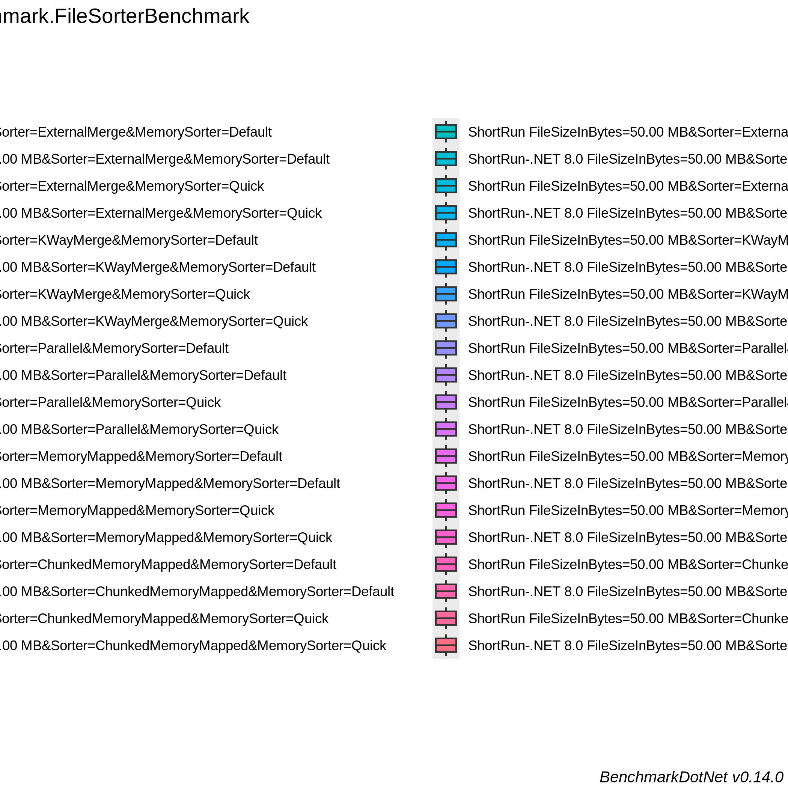

<!-- BENCHMARK RESULTS START -->

## Benchmark Results

*Last updated on Tue Oct  1 21:55:19 UTC 2024 UTC*

```

BenchmarkDotNet v0.14.0, Ubuntu 22.04.5 LTS (Jammy Jellyfish)
AMD EPYC 7763, 1 CPU, 2 logical cores and 1 physical core
.NET SDK 8.0.402
  [Host]            : .NET 8.0.8 (8.0.824.36612), X64 RyuJIT AVX2
  ShortRun          : .NET 8.0.8 (8.0.824.36612), X64 RyuJIT AVX2
  ShortRun-.NET 8.0 : .NET 8.0.8 (8.0.824.36612), X64 RyuJIT AVX2

Runtime=.NET 8.0  IterationCount=3  LaunchCount=1  
WarmupCount=3  

```
| Method       | Job               | FileSizeInBytes | Generator          | Mean      | Error     | StdDev   | StdErr   | Min       | Q1        | Median    | Q3        | Max       | Op/s   | Rank | Gen0        | Gen1        | Gen2        | Allocated  |
|------------- |------------------ |---------------- |------------------- |----------:|----------:|---------:|---------:|----------:|----------:|----------:|----------:|----------:|-------:|-----:|------------:|------------:|------------:|-----------:|
| **GenerateFile** | **ShortRun**          | **1.00 GB**         | **Original**           |  **9.1913 s** | **12.7792 s** | **0.7005 s** | **0.4044 s** |  **8.4013 s** |  **8.9187 s** |  **9.4361 s** |  **9.5863 s** |  **9.7365 s** | **0.1088** |    **4** |  **75000.0000** |           **-** |           **-** | **5992.18 MB** |
| GenerateFile | ShortRun-.NET 8.0 | 1.00 GB         | Original           |  9.2296 s |  3.2972 s | 0.1807 s | 0.1043 s |  9.0261 s |  9.1585 s |  9.2910 s |  9.3313 s |  9.3716 s | 0.1083 |    4 |  75000.0000 |           - |           - | 5992.28 MB |
| **GenerateFile** | **ShortRun**          | **1.00 GB**         | **Buffered**           |  **7.8681 s** | **19.1025 s** | **1.0471 s** | **0.6045 s** |  **6.6804 s** |  **7.4732 s** |  **8.2661 s** |  **8.4620 s** |  **8.6578 s** | **0.1271** |    **4** | **667000.0000** | **629000.0000** | **629000.0000** | **5126.15 MB** |
| GenerateFile | ShortRun-.NET 8.0 | 1.00 GB         | Buffered           |  7.7998 s | 17.5449 s | 0.9617 s | 0.5552 s |  6.6894 s |  7.5203 s |  8.3512 s |  8.3550 s |  8.3589 s | 0.1282 |    4 | 666000.0000 | 628000.0000 | 628000.0000 | 5126.11 MB |
| **GenerateFile** | **ShortRun**          | **1.00 GB**         | **Parallel**           |  **5.8308 s** |  **3.6857 s** | **0.2020 s** | **0.1166 s** |  **5.6970 s** |  **5.7146 s** |  **5.7322 s** |  **5.8977 s** |  **6.0632 s** | **0.1715** |    **3** |   **5000.0000** |   **5000.0000** |   **5000.0000** | **4100.06 MB** |
| GenerateFile | ShortRun-.NET 8.0 | 1.00 GB         | Parallel           |  5.6878 s |  2.1354 s | 0.1170 s | 0.0676 s |  5.6006 s |  5.6213 s |  5.6419 s |  5.7314 s |  5.8208 s | 0.1758 |    3 |   5000.0000 |   5000.0000 |   5000.0000 | 4100.05 MB |
| **GenerateFile** | **ShortRun**          | **1.00 GB**         | **ByteChunksParallel** | **87.3608 s** |  **6.3276 s** | **0.3468 s** | **0.2002 s** | **87.1476 s** | **87.1607 s** | **87.1737 s** | **87.4674 s** | **87.7610 s** | **0.0114** |    **5** |  **65000.0000** |  **27000.0000** |  **27000.0000** | **7065.29 MB** |
| GenerateFile | ShortRun-.NET 8.0 | 1.00 GB         | ByteChunksParallel | 88.7630 s |  8.0106 s | 0.4391 s | 0.2535 s | 88.2862 s | 88.5690 s | 88.8518 s | 89.0013 s | 89.1508 s | 0.0113 |    5 |  59000.0000 |  21000.0000 |  21000.0000 | 7125.16 MB |
| **GenerateFile** | **ShortRun**          | **1.00 GB**         | **MemoryMapped**       |  **9.6152 s** |  **7.1983 s** | **0.3946 s** | **0.2278 s** |  **9.2084 s** |  **9.4246 s** |  **9.6408 s** |  **9.8185 s** |  **9.9963 s** | **0.1040** |    **4** | **101000.0000** |           **-** |           **-** | **8115.28 MB** |
| GenerateFile | ShortRun-.NET 8.0 | 1.00 GB         | MemoryMapped       |  9.6831 s |  7.1138 s | 0.3899 s | 0.2251 s |  9.3074 s |  9.4818 s |  9.6562 s |  9.8710 s | 10.0858 s | 0.1033 |    4 | 101000.0000 |           - |           - | 8115.62 MB |
| **GenerateFile** | **ShortRun**          | **100.00 MB**       | **Original**           |  **0.8519 s** |  **0.2467 s** | **0.0135 s** | **0.0078 s** |  **0.8401 s** |  **0.8446 s** |  **0.8491 s** |  **0.8579 s** |  **0.8667 s** | **1.1738** |    **2** |   **7000.0000** |           **-** |           **-** |   **585.5 MB** |
| GenerateFile | ShortRun-.NET 8.0 | 100.00 MB       | Original           |  0.8406 s |  0.3539 s | 0.0194 s | 0.0112 s |  0.8251 s |  0.8297 s |  0.8344 s |  0.8484 s |  0.8623 s | 1.1896 |    2 |   7000.0000 |           - |           - |  585.46 MB |
| **GenerateFile** | **ShortRun**          | **100.00 MB**       | **Buffered**           |  **0.7319 s** |  **0.3371 s** | **0.0185 s** | **0.0107 s** |  **0.7157 s** |  **0.7218 s** |  **0.7280 s** |  **0.7400 s** |  **0.7520 s** | **1.3663** |    **2** |  **64000.0000** |  **61000.0000** |  **61000.0000** |  **502.74 MB** |
| GenerateFile | ShortRun-.NET 8.0 | 100.00 MB       | Buffered           |  0.6932 s |  0.2009 s | 0.0110 s | 0.0064 s |  0.6813 s |  0.6882 s |  0.6951 s |  0.6991 s |  0.7031 s | 1.4426 |    2 |  63000.0000 |  60000.0000 |  60000.0000 |  502.74 MB |
| **GenerateFile** | **ShortRun**          | **100.00 MB**       | **Parallel**           |  **0.5482 s** |  **0.0522 s** | **0.0029 s** | **0.0017 s** |  **0.5464 s** |  **0.5465 s** |  **0.5466 s** |  **0.5490 s** |  **0.5515 s** | **1.8242** |    **1** |   **2000.0000** |   **2000.0000** |   **2000.0000** |  **440.71 MB** |
| GenerateFile | ShortRun-.NET 8.0 | 100.00 MB       | Parallel           |  0.5468 s |  0.2378 s | 0.0130 s | 0.0075 s |  0.5376 s |  0.5393 s |  0.5410 s |  0.5513 s |  0.5617 s | 1.8290 |    1 |   3000.0000 |   3000.0000 |   3000.0000 |  440.71 MB |
| **GenerateFile** | **ShortRun**          | **100.00 MB**       | **ByteChunksParallel** |  **9.2770 s** |  **1.0789 s** | **0.0591 s** | **0.0341 s** |  **9.2370 s** |  **9.2430 s** |  **9.2490 s** |  **9.2969 s** |  **9.3449 s** | **0.1078** |    **4** |   **8000.0000** |   **4000.0000** |   **4000.0000** |  **769.77 MB** |
| GenerateFile | ShortRun-.NET 8.0 | 100.00 MB       | ByteChunksParallel |  9.1787 s |  2.1878 s | 0.1199 s | 0.0692 s |  9.0403 s |  9.1432 s |  9.2461 s |  9.2479 s |  9.2498 s | 0.1089 |    4 |   8000.0000 |   4000.0000 |   4000.0000 |  729.71 MB |
| **GenerateFile** | **ShortRun**          | **100.00 MB**       | **MemoryMapped**       |  **0.8984 s** |  **0.0427 s** | **0.0023 s** | **0.0014 s** |  **0.8959 s** |  **0.8973 s** |  **0.8987 s** |  **0.8996 s** |  **0.9005 s** | **1.1131** |    **2** |   **9000.0000** |           **-** |           **-** |  **792.39 MB** |
| GenerateFile | ShortRun-.NET 8.0 | 100.00 MB       | MemoryMapped       |  0.8938 s |  0.0188 s | 0.0010 s | 0.0006 s |  0.8927 s |  0.8934 s |  0.8942 s |  0.8944 s |  0.8946 s | 1.1188 |    2 |   9000.0000 |           - |           - |  792.43 MB |
```

BenchmarkDotNet v0.14.0, Ubuntu 22.04.5 LTS (Jammy Jellyfish)
AMD EPYC 7763, 1 CPU, 2 logical cores and 1 physical core
.NET SDK 8.0.402
  [Host]            : .NET 8.0.8 (8.0.824.36612), X64 RyuJIT AVX2
  ShortRun          : .NET 8.0.8 (8.0.824.36612), X64 RyuJIT AVX2
  ShortRun-.NET 8.0 : .NET 8.0.8 (8.0.824.36612), X64 RyuJIT AVX2

Runtime=.NET 8.0  IterationCount=3  LaunchCount=1  
WarmupCount=3  

```
| Method   | Job               | FileSizeInBytes | Sorter              | MemorySorter | Mean     | Error     | StdDev   | StdErr   | Min      | Q1       | Median   | Q3       | Max      | Op/s   | Rank | Gen0        | Gen1       | Gen2      | Allocated   |
|--------- |------------------ |---------------- |-------------------- |------------- |---------:|----------:|---------:|---------:|---------:|---------:|---------:|---------:|---------:|-------:|-----:|------------:|-----------:|----------:|------------:|
| **SortFile** | **ShortRun**          | **100.00 MB**       | **ExternalMerge**       | **Default**      | **18.237 s** |  **2.4341 s** | **0.1334 s** | **0.0770 s** | **18.083 s** | **18.198 s** | **18.312 s** | **18.314 s** | **18.317 s** | **0.0548** |    **2** | **256000.0000** | **12000.0000** | **3000.0000** | **20286.47 MB** |
| SortFile | ShortRun-.NET 8.0 | 100.00 MB       | ExternalMerge       | Default      | 18.222 s |  1.5757 s | 0.0864 s | 0.0499 s | 18.123 s | 18.190 s | 18.257 s | 18.271 s | 18.285 s | 0.0549 |    2 | 254000.0000 | 12000.0000 | 3000.0000 | 20173.06 MB |
| **SortFile** | **ShortRun**          | **100.00 MB**       | **ExternalMerge**       | **Quick**        | **20.527 s** |  **1.7528 s** | **0.0961 s** | **0.0555 s** | **20.424 s** | **20.484 s** | **20.543 s** | **20.579 s** | **20.615 s** | **0.0487** |    **2** | **281000.0000** | **12000.0000** | **3000.0000** | **22315.02 MB** |
| SortFile | ShortRun-.NET 8.0 | 100.00 MB       | ExternalMerge       | Quick        | 19.872 s |  0.7209 s | 0.0395 s | 0.0228 s | 19.838 s | 19.851 s | 19.863 s | 19.889 s | 19.916 s | 0.0503 |    2 | 279000.0000 | 12000.0000 | 3000.0000 | 22141.66 MB |
| **SortFile** | **ShortRun**          | **100.00 MB**       | **KWayMerge**           | **Default**      | **18.632 s** |  **3.6846 s** | **0.2020 s** | **0.1166 s** | **18.511 s** | **18.516 s** | **18.520 s** | **18.693 s** | **18.865 s** | **0.0537** |    **2** | **258000.0000** | **12000.0000** | **3000.0000** | **20474.45 MB** |
| SortFile | ShortRun-.NET 8.0 | 100.00 MB       | KWayMerge           | Default      | 19.061 s |  7.3540 s | 0.4031 s | 0.2327 s | 18.707 s | 18.842 s | 18.978 s | 19.239 s | 19.500 s | 0.0525 |    2 | 260000.0000 | 12000.0000 | 3000.0000 | 20606.96 MB |
| **SortFile** | **ShortRun**          | **100.00 MB**       | **KWayMerge**           | **Quick**        | **20.738 s** | **11.2834 s** | **0.6185 s** | **0.3571 s** | **20.024 s** | **20.556 s** | **21.089 s** | **21.095 s** | **21.101 s** | **0.0482** |    **2** | **282000.0000** | **12000.0000** | **3000.0000** | **22368.35 MB** |
| SortFile | ShortRun-.NET 8.0 | 100.00 MB       | KWayMerge           | Quick        | 20.512 s |  3.4604 s | 0.1897 s | 0.1095 s | 20.293 s | 20.456 s | 20.619 s | 20.621 s | 20.623 s | 0.0488 |    2 | 276000.0000 | 12000.0000 | 3000.0000 | 21916.78 MB |
| **SortFile** | **ShortRun**          | **100.00 MB**       | **Parallel**            | **Default**      | **18.562 s** |  **1.3269 s** | **0.0727 s** | **0.0420 s** | **18.482 s** | **18.531 s** | **18.580 s** | **18.602 s** | **18.624 s** | **0.0539** |    **2** | **254000.0000** | **12000.0000** | **3000.0000** | **20168.32 MB** |
| SortFile | ShortRun-.NET 8.0 | 100.00 MB       | Parallel            | Default      | 17.945 s |  1.5071 s | 0.0826 s | 0.0477 s | 17.865 s | 17.903 s | 17.940 s | 17.985 s | 18.030 s | 0.0557 |    2 | 254000.0000 | 12000.0000 | 3000.0000 | 20168.66 MB |
| **SortFile** | **ShortRun**          | **100.00 MB**       | **Parallel**            | **Quick**        | **20.399 s** |  **1.9110 s** | **0.1048 s** | **0.0605 s** | **20.290 s** | **20.349 s** | **20.409 s** | **20.454 s** | **20.498 s** | **0.0490** |    **2** | **281000.0000** | **12000.0000** | **3000.0000** | **22383.36 MB** |
| SortFile | ShortRun-.NET 8.0 | 100.00 MB       | Parallel            | Quick        | 19.848 s |  5.5089 s | 0.3020 s | 0.1743 s | 19.559 s | 19.692 s | 19.824 s | 19.993 s | 20.162 s | 0.0504 |    2 | 276000.0000 | 12000.0000 | 3000.0000 | 21956.14 MB |
| **SortFile** | **ShortRun**          | **100.00 MB**       | **MemoryMapped**        | **Default**      | **17.040 s** |  **2.3572 s** | **0.1292 s** | **0.0746 s** | **16.955 s** | **16.966 s** | **16.977 s** | **17.083 s** | **17.189 s** | **0.0587** |    **2** | **241000.0000** | **21000.0000** | **5000.0000** | **19024.61 MB** |
| SortFile | ShortRun-.NET 8.0 | 100.00 MB       | MemoryMapped        | Default      | 16.984 s |  1.7125 s | 0.0939 s | 0.0542 s | 16.888 s | 16.939 s | 16.990 s | 17.033 s | 17.075 s | 0.0589 |    2 | 241000.0000 | 21000.0000 | 5000.0000 | 18966.85 MB |
| **SortFile** | **ShortRun**          | **100.00 MB**       | **MemoryMapped**        | **Quick**        | **18.474 s** |  **1.4221 s** | **0.0780 s** | **0.0450 s** | **18.385 s** | **18.445 s** | **18.505 s** | **18.518 s** | **18.531 s** | **0.0541** |    **2** | **274000.0000** | **21000.0000** | **5000.0000** | **21607.92 MB** |
| SortFile | ShortRun-.NET 8.0 | 100.00 MB       | MemoryMapped        | Quick        | 18.312 s |  2.9246 s | 0.1603 s | 0.0926 s | 18.128 s | 18.255 s | 18.383 s | 18.403 s | 18.424 s | 0.0546 |    2 | 263000.0000 | 21000.0000 | 5000.0000 | 20736.51 MB |
| **SortFile** | **ShortRun**          | **100.00 MB**       | **ChunkedMemoryMapped** | **Default**      |       **NA** |        **NA** |       **NA** |       **NA** |       **NA** |       **NA** |       **NA** |       **NA** |       **NA** |     **NA** |    **?** |          **NA** |         **NA** |        **NA** |          **NA** |
| SortFile | ShortRun-.NET 8.0 | 100.00 MB       | ChunkedMemoryMapped | Default      |       NA |        NA |       NA |       NA |       NA |       NA |       NA |       NA |       NA |     NA |    ? |          NA |         NA |        NA |          NA |
| **SortFile** | **ShortRun**          | **100.00 MB**       | **ChunkedMemoryMapped** | **Quick**        |       **NA** |        **NA** |       **NA** |       **NA** |       **NA** |       **NA** |       **NA** |       **NA** |       **NA** |     **NA** |    **?** |          **NA** |         **NA** |        **NA** |          **NA** |
| SortFile | ShortRun-.NET 8.0 | 100.00 MB       | ChunkedMemoryMapped | Quick        |       NA |        NA |       NA |       NA |       NA |       NA |       NA |       NA |       NA |     NA |    ? |          NA |         NA |        NA |          NA |
| **SortFile** | **ShortRun**          | **50.00 MB**        | **ExternalMerge**       | **Default**      |  **8.530 s** |  **0.2696 s** | **0.0148 s** | **0.0085 s** |  **8.517 s** |  **8.521 s** |  **8.526 s** |  **8.536 s** |  **8.546 s** | **0.1172** |    **1** | **120000.0000** |  **7000.0000** | **2000.0000** |  **9550.41 MB** |
| SortFile | ShortRun-.NET 8.0 | 50.00 MB        | ExternalMerge       | Default      |  8.582 s |  0.3493 s | 0.0191 s | 0.0111 s |  8.563 s |  8.572 s |  8.582 s |  8.591 s |  8.601 s | 0.1165 |    1 | 124000.0000 |  7000.0000 | 2000.0000 |  9803.37 MB |
| **SortFile** | **ShortRun**          | **50.00 MB**        | **ExternalMerge**       | **Quick**        |  **9.176 s** |  **0.9255 s** | **0.0507 s** | **0.0293 s** |  **9.130 s** |  **9.149 s** |  **9.168 s** |  **9.199 s** |  **9.231 s** | **0.1090** |    **1** | **133000.0000** |  **7000.0000** | **2000.0000** | **10555.62 MB** |
| SortFile | ShortRun-.NET 8.0 | 50.00 MB        | ExternalMerge       | Quick        |  9.077 s |  1.7372 s | 0.0952 s | 0.0550 s |  8.999 s |  9.024 s |  9.048 s |  9.116 s |  9.183 s | 0.1102 |    1 | 135000.0000 |  7000.0000 | 2000.0000 | 10699.54 MB |
| **SortFile** | **ShortRun**          | **50.00 MB**        | **KWayMerge**           | **Default**      |  **8.395 s** |  **1.1032 s** | **0.0605 s** | **0.0349 s** |  **8.333 s** |  **8.366 s** |  **8.398 s** |  **8.426 s** |  **8.454 s** | **0.1191** |    **1** | **121000.0000** |  **7000.0000** | **2000.0000** |  **9614.16 MB** |
| SortFile | ShortRun-.NET 8.0 | 50.00 MB        | KWayMerge           | Default      |  8.542 s |  1.0670 s | 0.0585 s | 0.0338 s |  8.497 s |  8.509 s |  8.520 s |  8.564 s |  8.608 s | 0.1171 |    1 | 124000.0000 |  7000.0000 | 2000.0000 |  9832.56 MB |
| **SortFile** | **ShortRun**          | **50.00 MB**        | **KWayMerge**           | **Quick**        |  **9.163 s** |  **1.3453 s** | **0.0737 s** | **0.0426 s** |  **9.087 s** |  **9.127 s** |  **9.167 s** |  **9.200 s** |  **9.234 s** | **0.1091** |    **1** | **132000.0000** |  **7000.0000** | **2000.0000** | **10467.04 MB** |
| SortFile | ShortRun-.NET 8.0 | 50.00 MB        | KWayMerge           | Quick        |  9.429 s |  2.2864 s | 0.1253 s | 0.0724 s |  9.285 s |  9.386 s |  9.486 s |  9.501 s |  9.516 s | 0.1061 |    1 | 133000.0000 |  7000.0000 | 2000.0000 | 10561.66 MB |
| **SortFile** | **ShortRun**          | **50.00 MB**        | **Parallel**            | **Default**      |  **8.697 s** |  **0.6424 s** | **0.0352 s** | **0.0203 s** |  **8.675 s** |  **8.677 s** |  **8.678 s** |  **8.708 s** |  **8.738 s** | **0.1150** |    **1** | **121000.0000** |  **7000.0000** | **2000.0000** |  **9588.95 MB** |
| SortFile | ShortRun-.NET 8.0 | 50.00 MB        | Parallel            | Default      |  8.610 s |  0.9605 s | 0.0526 s | 0.0304 s |  8.574 s |  8.579 s |  8.585 s |  8.627 s |  8.670 s | 0.1161 |    1 | 123000.0000 |  7000.0000 | 2000.0000 |   9782.4 MB |
| **SortFile** | **ShortRun**          | **50.00 MB**        | **Parallel**            | **Quick**        |  **9.238 s** |  **1.9067 s** | **0.1045 s** | **0.0603 s** |  **9.152 s** |  **9.180 s** |  **9.208 s** |  **9.281 s** |  **9.355 s** | **0.1082** |    **1** | **135000.0000** |  **7000.0000** | **2000.0000** | **10738.63 MB** |
| SortFile | ShortRun-.NET 8.0 | 50.00 MB        | Parallel            | Quick        |  9.338 s |  1.2900 s | 0.0707 s | 0.0408 s |  9.292 s |  9.298 s |  9.303 s |  9.361 s |  9.420 s | 0.1071 |    1 | 132000.0000 |  7000.0000 | 2000.0000 | 10503.52 MB |
| **SortFile** | **ShortRun**          | **50.00 MB**        | **MemoryMapped**        | **Default**      |  **8.052 s** |  **0.3405 s** | **0.0187 s** | **0.0108 s** |  **8.031 s** |  **8.047 s** |  **8.063 s** |  **8.063 s** |  **8.064 s** | **0.1242** |    **1** | **118000.0000** | **12000.0000** | **4000.0000** |  **9229.83 MB** |
| SortFile | ShortRun-.NET 8.0 | 50.00 MB        | MemoryMapped        | Default      |  8.338 s |  1.1671 s | 0.0640 s | 0.0369 s |  8.278 s |  8.305 s |  8.332 s |  8.368 s |  8.405 s | 0.1199 |    1 | 116000.0000 | 12000.0000 | 4000.0000 |  9073.68 MB |
| **SortFile** | **ShortRun**          | **50.00 MB**        | **MemoryMapped**        | **Quick**        |  **8.867 s** |  **1.1072 s** | **0.0607 s** | **0.0350 s** |  **8.819 s** |  **8.832 s** |  **8.846 s** |  **8.890 s** |  **8.935 s** | **0.1128** |    **1** | **129000.0000** | **12000.0000** | **4000.0000** | **10097.02 MB** |
| SortFile | ShortRun-.NET 8.0 | 50.00 MB        | MemoryMapped        | Quick        |  8.722 s |  0.2724 s | 0.0149 s | 0.0086 s |  8.706 s |  8.714 s |  8.723 s |  8.729 s |  8.736 s | 0.1147 |    1 | 129000.0000 | 12000.0000 | 4000.0000 | 10074.92 MB |
| **SortFile** | **ShortRun**          | **50.00 MB**        | **ChunkedMemoryMapped** | **Default**      |       **NA** |        **NA** |       **NA** |       **NA** |       **NA** |       **NA** |       **NA** |       **NA** |       **NA** |     **NA** |    **?** |          **NA** |         **NA** |        **NA** |          **NA** |
| SortFile | ShortRun-.NET 8.0 | 50.00 MB        | ChunkedMemoryMapped | Default      |       NA |        NA |       NA |       NA |       NA |       NA |       NA |       NA |       NA |     NA |    ? |          NA |         NA |        NA |          NA |
| **SortFile** | **ShortRun**          | **50.00 MB**        | **ChunkedMemoryMapped** | **Quick**        |       **NA** |        **NA** |       **NA** |       **NA** |       **NA** |       **NA** |       **NA** |       **NA** |       **NA** |     **NA** |    **?** |          **NA** |         **NA** |        **NA** |          **NA** |
| SortFile | ShortRun-.NET 8.0 | 50.00 MB        | ChunkedMemoryMapped | Quick        |       NA |        NA |       NA |       NA |       NA |       NA |       NA |       NA |       NA |     NA |    ? |          NA |         NA |        NA |          NA |

Benchmarks with issues:
FileSorterBenchmark.SortFile: ShortRun(IterationCount=3, LaunchCount=1, WarmupCount=3) [FileSizeInBytes=100.00 MB, Sorter=ChunkedMemoryMapped, MemorySorter=Default]
FileSorterBenchmark.SortFile: ShortRun-.NET 8.0(Runtime=.NET 8.0, IterationCount=3, LaunchCount=1, WarmupCount=3) [FileSizeInBytes=100.00 MB, Sorter=ChunkedMemoryMapped, MemorySorter=Default]
FileSorterBenchmark.SortFile: ShortRun(IterationCount=3, LaunchCount=1, WarmupCount=3) [FileSizeInBytes=100.00 MB, Sorter=ChunkedMemoryMapped, MemorySorter=Quick]
FileSorterBenchmark.SortFile: ShortRun-.NET 8.0(Runtime=.NET 8.0, IterationCount=3, LaunchCount=1, WarmupCount=3) [FileSizeInBytes=100.00 MB, Sorter=ChunkedMemoryMapped, MemorySorter=Quick]
FileSorterBenchmark.SortFile: ShortRun(IterationCount=3, LaunchCount=1, WarmupCount=3) [FileSizeInBytes=50.00 MB, Sorter=ChunkedMemoryMapped, MemorySorter=Default]
FileSorterBenchmark.SortFile: ShortRun-.NET 8.0(Runtime=.NET 8.0, IterationCount=3, LaunchCount=1, WarmupCount=3) [FileSizeInBytes=50.00 MB, Sorter=ChunkedMemoryMapped, MemorySorter=Default]
FileSorterBenchmark.SortFile: ShortRun(IterationCount=3, LaunchCount=1, WarmupCount=3) [FileSizeInBytes=50.00 MB, Sorter=ChunkedMemoryMapped, MemorySorter=Quick]
FileSorterBenchmark.SortFile: ShortRun-.NET 8.0(Runtime=.NET 8.0, IterationCount=3, LaunchCount=1, WarmupCount=3) [FileSizeInBytes=50.00 MB, Sorter=ChunkedMemoryMapped, MemorySorter=Quick]
### Performance Barplot


### Performance Barplot


### Performance Boxplot


### Performance Boxplot


<!-- BENCHMARK RESULTS END -->
