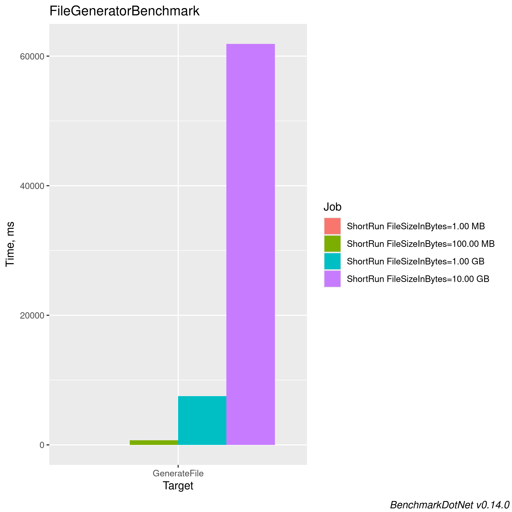

# Big files utils

## Benchmark Results


<!-- BENCHMARK RESULTS START -->

*Last updated on Sat Sep 28 05:10:21 UTC 2024 UTC*

```

BenchmarkDotNet v0.14.0, Ubuntu 22.04.5 LTS (Jammy Jellyfish)
AMD EPYC 7763, 1 CPU, 2 logical cores and 1 physical core
.NET SDK 8.0.402
  [Host]   : .NET 8.0.8 (8.0.824.36612), X64 RyuJIT AVX2
  ShortRun : .NET 8.0.8 (8.0.824.36612), X64 RyuJIT AVX2

Job=ShortRun  Server=True  IterationCount=3  
LaunchCount=1  WarmupCount=3  

```
| Method       | FileSizeInBytes | Mean       | Error       | StdDev     | Min        | Max        | Q1         | Q3         | Median     | Gen0      | Gen1    | Gen2    | Allocated    |
|------------- |---------------- |-----------:|------------:|-----------:|-----------:|-----------:|-----------:|-----------:|-----------:|----------:|--------:|--------:|-------------:|
| **GenerateFile** | **102400**          |   **1.222 ms** |   **0.9287 ms** |  **0.0509 ms** |   **1.192 ms** |   **1.281 ms** |   **1.192 ms** |   **1.237 ms** |   **1.193 ms** |   **62.5000** | **62.5000** | **62.5000** |    **909.96 KB** |
| **GenerateFile** | **10485760**        |  **65.993 ms** |  **31.8592 ms** |  **1.7463 ms** |  **64.580 ms** |  **67.945 ms** |  **65.016 ms** |  **66.699 ms** |  **65.452 ms** |  **125.0000** |       **-** |       **-** |  **60196.83 KB** |
| **GenerateFile** | **104857600**       | **740.475 ms** | **297.7081 ms** | **16.3184 ms** | **726.180 ms** | **758.254 ms** | **731.586 ms** | **747.623 ms** | **736.992 ms** | **1000.0000** |       **-** |       **-** | **599113.37 KB** |



<!-- BENCHMARK RESULTS END -->
