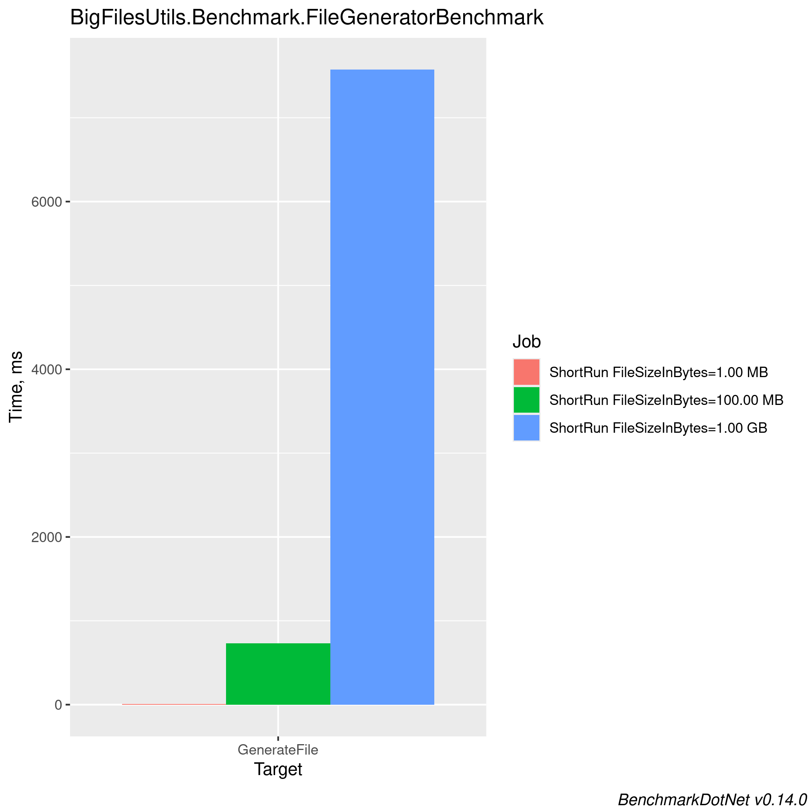

# Big files utils

## Benchmark Results


<!-- BENCHMARK RESULTS START -->

## Benchmark Results

*Last updated on Sun Sep 29 06:05:59 UTC 2024 UTC*

```

BenchmarkDotNet v0.14.0, Ubuntu 22.04.5 LTS (Jammy Jellyfish)
AMD EPYC 7763, 1 CPU, 2 logical cores and 1 physical core
.NET SDK 8.0.402
  [Host]     : .NET 8.0.8 (8.0.824.36612), X64 RyuJIT AVX2
  Job-UQWZJB : .NET 8.0.8 (8.0.824.36612), X64 RyuJIT AVX2

Server=True  InvocationCount=3  IterationCount=3  
LaunchCount=5  UnrollFactor=1  WarmupCount=2  

```
| Method       | FileSizeInBytes | Generator    | FileSize | Mean     | Error    | StdDev   | StdErr   | Median   | Min      | Max      | Rank | Allocated |
|------------- |---------------- |------------- |--------- |---------:|---------:|---------:|---------:|---------:|---------:|---------:|-----:|----------:|
| GenerateFile | 100.00 MB       | MemoryMapped | ?        | 0.0000 s | 0.0000 s | 0.0000 s | 0.0000 s | 0.0000 s | 0.0000 s | 0.0001 s |    1 |   0.13 MB |
| GenerateFile | 100.00 MB       | Parallel     | ?        | 0.0000 s | 0.0000 s | 0.0000 s | 0.0000 s | 0.0000 s | 0.0000 s | 0.0000 s |    2 |   0.49 MB |
| GenerateFile | 500.00 MB       | Parallel     | ?        | 0.0000 s | 0.0000 s | 0.0000 s | 0.0000 s | 0.0000 s | 0.0000 s | 0.0000 s |    2 |   0.07 MB |
| GenerateFile | 1.00 GB         | Parallel     | ?        | 0.0000 s | 0.0000 s | 0.0000 s | 0.0000 s | 0.0000 s | 0.0000 s | 0.0000 s |    2 |   1.42 MB |
| GenerateFile | 1.00 GB         | MemoryMapped | ?        | 0.0000 s | 0.0001 s | 0.0001 s | 0.0000 s | 0.0000 s | 0.0000 s | 0.0003 s |    3 |   0.02 MB |
| GenerateFile | 500.00 MB       | MemoryMapped | ?        | 0.0000 s | 0.0001 s | 0.0001 s | 0.0000 s | 0.0000 s | 0.0000 s | 0.0003 s |    3 |    1.2 MB |
| GenerateFile | 1.00 GB         | Buffered     | ?        | 0.0015 s | 0.0006 s | 0.0005 s | 0.0001 s | 0.0012 s | 0.0009 s | 0.0027 s |    4 |   2.28 MB |
| GenerateFile | 500.00 MB       | Original     | ?        | 0.0017 s | 0.0007 s | 0.0006 s | 0.0002 s | 0.0013 s | 0.0011 s | 0.0028 s |    4 |   2.46 MB |
| GenerateFile | 100.00 MB       | Original     | ?        | 0.0018 s | 0.0008 s | 0.0007 s | 0.0002 s | 0.0015 s | 0.0011 s | 0.0038 s |    4 |    1.2 MB |
| GenerateFile | 1.00 GB         | Original     | ?        | 0.0018 s | 0.0007 s | 0.0006 s | 0.0002 s | 0.0019 s | 0.0011 s | 0.0029 s |    4 |   2.11 MB |
| GenerateFile | 100.00 MB       | Buffered     | ?        | 0.0019 s | 0.0008 s | 0.0007 s | 0.0002 s | 0.0019 s | 0.0010 s | 0.0031 s |    4 |   2.57 MB |
| GenerateFile | 500.00 MB       | Buffered     | ?        | 0.0020 s | 0.0010 s | 0.0010 s | 0.0003 s | 0.0019 s | 0.0009 s | 0.0038 s |    4 |   3.41 MB |

### Performance Barplot


### Measurement Overhead Plot


### Distribution Plot


<!-- BENCHMARK RESULTS END -->
